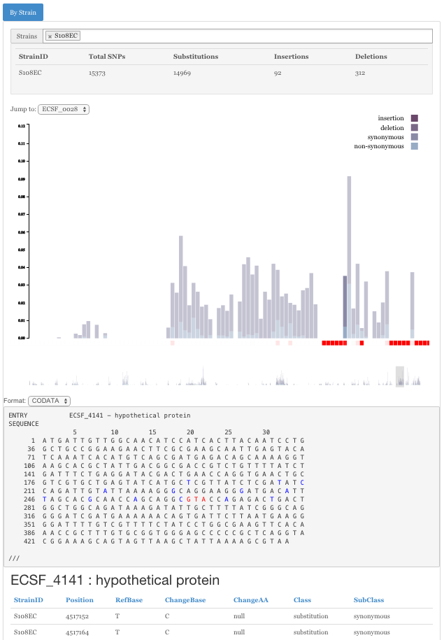

BanzaiVis
=========

Visualise results from BanzaiDB

Install
-------

Something like this::

    $ git clone git@github.com:m-emerson/BanzaiVis.git
    $ cd BanzaiVis
    $ python setup.py install

Deploy (work in progress)
-------------------------

Designed to gunicorn+nginx stack:

Something like::
    
    $ git clone git@github.com:m-emerson/BanzaiVis.git
    $ cd BanzaiVis
    $ pip install -r requirements.txt
    $ cd deploy
    $ fab start_gunicorn_server

Usage
-----

In your code import it::

    >>> import banzaivis
    >>> from banzaivis import queries

**Note:** BanzaiVis uses BanzaiDB as its datastore.  Please refer to the `BanzaiDB documentation`_ (via ReadTheDocs) for detailed information on how to set up a custom BanzaiDB instance.  Otherwise, the defaults will be used.

Usage instructions::

    usage: application.py [-?] {shell,init_db,populate,runserver} ...

    positional arguments:
      {shell,init_db,populate,runserver}
        shell               Runs a Python shell inside Flask application context.
        init_db             Initialises the database with BanzaiDB defaults
        populate            Populate the datababase with nesoni mapping run using
                        BanzaiDB :param run_path: full path as a string to the
                        Banzai run (inclusive of $PROJECTBASE). For example:
                        /$PROJECTBASE/map/$REF.2014-04-28-mon-16-41-51
        runserver           Runs the Flask development server i.e. app.run()

    optional arguments:
      -?, --help            show this help message and exit

API Reference
-------------
See `wiki`_.

.. _BanzaiDB documentation: http://banzaidb.readthedocs.org
.. _wiki: https://github.com/m-emerson/BanzaiVis/wiki/API-Reference
